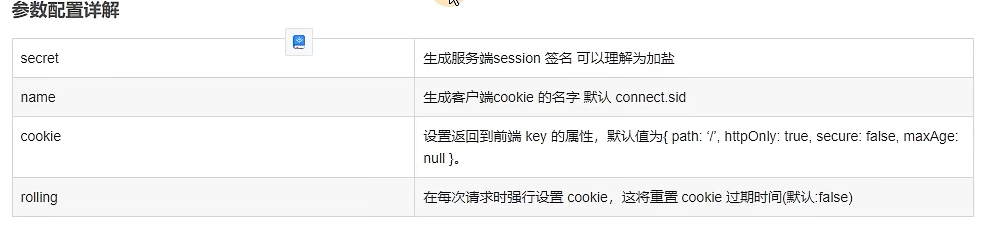

安装插件

```bash
pnpm i express-session --save
pnpm i @types/express-session -D
```

main.ts 引入
```ts{9-16}
import * as session from 'express-session'

async function bootstrap() {
  const app = await NestFactory.create(AppModule);
  // 开启一个选项
  app.enableVersioning({
    type:VersioningType.URI
  })
  app.use(
    session({
      secret: 'XiaoNing',
      rolling: true,
      name: 'xiaoning.sid',
      cookie: { maxAge: 99999 },
    }),
  );
  await app.listen(3000);
}
```

session参数配置详解

